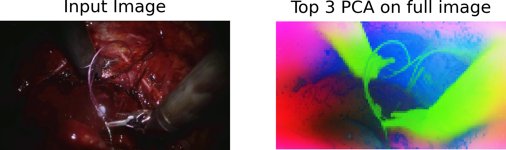
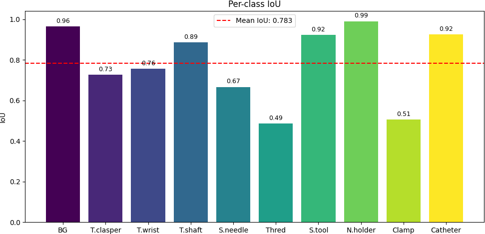

Repository to train a segmentation network on the [SAR-RARP50 2022](https://www.synapse.org/Synapse:syn27618412/wiki/616881) surgical instrument dataset.

We use the DinoV3 with a DPT head for dense semantic segmentation.

## Environment Setup

```bash
conda create -n dino python=3.10.16

conda activate dino

pip install -r requirements.txt
````

Clone the DINOv3 repository:

```bash
git clone https://github.com/facebookresearch/dinov3.git
```

Download [DINOv3](https://github.com/facebookresearch/dinov3)  pretrained weights and place them in:

```
./ckpt
```

## Dataset Preparation
Donwload data into  
```
./segdata/mmr
```
and place them into the `test` and `train` respectively. Then run:
```bash
python extract.py \
--data_dir ./segdata/mmr
```

Each dataset subfolder should contain a `frames` directory and a `segmentation` directory.

## Model Capacity
You can visualise the first three PCA features of the model using:
```bash
python visualise_pca.py \
--input_frame ./segdata/mmr/frames/video_01_000004740.png
--only_fg 0/1
```

## Training

Example training command:

```bash
python train.py \
  --data_dir ./segdata/mmr \
  --input_h 544 --input_w 960 \
  --num_classes 10 \
  --dino_size s \
  --dino_ckpt ./ckpt/dinov3_vits16_pretrain_lvd1689m-08c60483.pth \
  --repo_dir ./dinov3 \
  --epochs 50 \
  --batch_size 4 \
  --lr 1e-4 \
  --epochs 35
```

## Testing

Example testing command:

```bash
python test.py \
  --data_dir ./segdata/mmr \
  --input_h 1088 --input_w 1920 \
  --num_classes 10 \
  --dino_size s \
  --dino_ckpt ./ckpt/dinov3_vits16_pretrain_lvd1689m-08c60483.pth \
  --ckpt ./tn3k.pth \
  --repo_dir ./dinov3 \
```

## Results
### Top 3 PCA on full image:


Results indicate that the model has good enough capacity to distinguish between foreground and background.

### Top 3 PCA on F/G:


Results indicate that the model has good enough capacity to distinguish between objects in foreground.

### Results for the smallest model with half resolution and after 35 epochs
#### Per-class dice coefficient (soft):


#### Per-class IoU:


 
* Encoraging results with smallest network.
* Good point to start large scale training with enough resources.

#### Video Results (click for the full video)
[](https://youtu.be/eYu81MW8a1M)


## Notes

* Both train and test support the largest and smallest dino model but has been tested only on the smallest one due to resource constraint. Its trivially extendable to other models as well.
* Make sure the pretrained DINO weights (`.pth` file) are correctly downloaded and placed under `./ckpt`.
* Modify paths as needed for your environment.
* Training and testing configurations (e.g., image size, batch size, learning rate) can be adjusted via command-line arguments.

## Acknowledgements

We would like to thank the open-source community for their invaluable contributions.  
In particular, we acknowledge the following repositories that made this work possible:

- [DINOv3](https://github.com/facebookresearch/dinov3)   

- [DPT](https://github.com/isl-org/DPT)

- [Unimatch](https://github.com/LiheYoung/UniMatch-V2)

- [SegDino](https://arxiv.org/pdf/2509.00833)